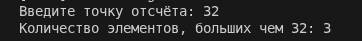
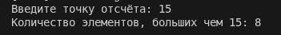

# 1

    Данный код будет работать за линейное время, так как цикл выполняется ровно столько раз, сколько элементов в массиве. Памяти потребуется O(1), так как дополнительные массивы хранить не нужно. Код вычисляется сумму разностей соседних элементов.

# 2

[main.cpp](./_task2/main.cpp)

