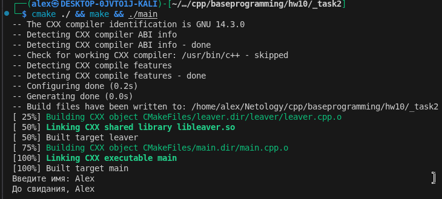

## Result

# Task 1

[CMakeLists.txt](./_task1/CMakeLists.txt)

[main.cpp](./_task1/main.cpp)

[greeter.h](./_task1/greeter/greeter.h)

[greeter.cpp](./_task1/greeter/greeter.cpp)

# Task 2

[CMakeLists.txt](./_task2/CMakeLists.txt)

[main.cpp](./_task2/main.cpp)

[leaver.h](./_task2/leaver/leaver.h)

[leaver.cpp](./_task2/leaver/leaver.cpp)

# Task 3

[CMakeLists.txt](./_task3/CMakeLists.txt)

[main.cpp](./_task3/main.cpp)

[leaver.h](./_task3/leaver/leaver.h)

[leaver.cpp](./_task3/leaver/leaver.cpp)

