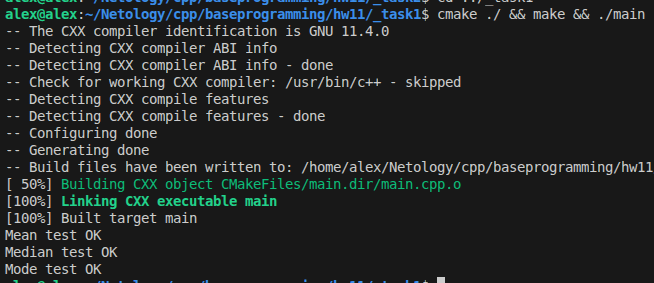
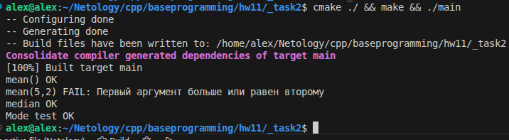
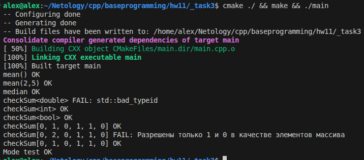

## Result

# Task 1

[CMakeLists.txt](./_task1/CMakeLists.txt)

[main.cpp](./_task1/main.cpp)

[extended_array.h](./_task1/extended_array.h)

# Task 2

[CMakeLists.txt](./_task2/CMakeLists.txt)

[main.h](./_task2/main.h)

[main.cpp](./_task2/main.cpp)

[extended_array.h](./_task2/extended_array.h)

# Task 3

[CMakeLists.txt](./_task3/CMakeLists.txt)

[main.h](./_task3/main.h)

[main.cpp](./_task3/main.cpp)

[extended_array.h](./_task3/extended_array.h)

