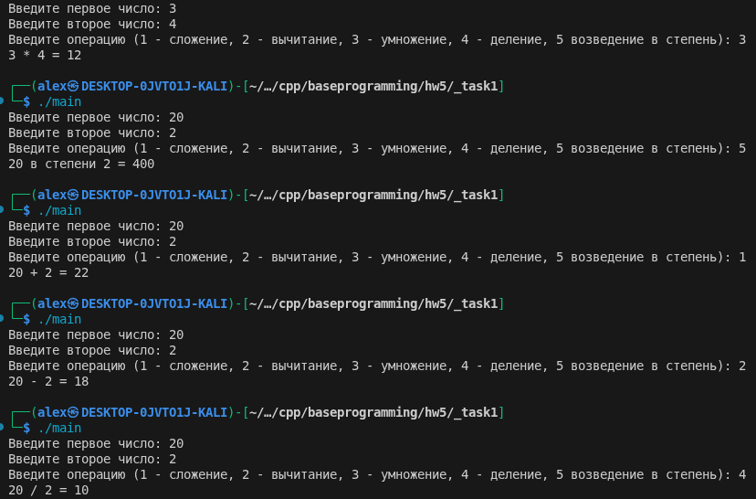
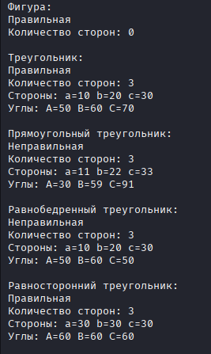
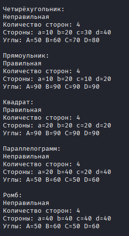

## Result

# Task 1

[main.cpp](./_task1/main.cpp)

[math.h](./_task1/math.h)

[math.cpp](./_task1/math.cpp)

# Task 2

[main.cpp](./_task2/main.cpp)

[counter.h](./_task2/counter.h)

[counter.cpp](./_task2/counter.cpp)

# Task 3

[main](./_task3/main.cpp)

[figure.h](./_task3/figure.h)

[figure.cpp](./_task3/figure.cpp)

[triangle.h](./_task3/triangle.h)

[triangle.cpp](./_task3/triangle.cpp)

[rightTriangle.h](./_task3/rightTriange.h)

[rightTriangle.cpp](./_task3/rightTriangle.cpp)

[equilateralTriangle.h](./_task3/equilateralTriangle.h)

[equilateralTriangle.cpp](./_task3/equilateralTriangle.cpp)

[isoscelesTriangle.h](./_task3/isoscelesTriangle.h)

[isoscelesTriangle.cpp](./_task3/isoscelesTriangle.cpp)

[quadangle.h](./_task3/quadangle.h)

[quadangle.cpp](./_task3/quadangle.cpp)

[rectangle.h](./_task3/rectangle.h)

[rectangle.cpp](./_task3/rectangle.cpp)

[square.h](./_task3/square.h)

[square.cpp](./_task3/square.cpp)

[parallelogram.h](./_task3/parallelogram.h)

[parallelogram.cpp](./_task3/parallelogram.cpp)

[rum.h](./_task3/rum.h)

[rum.cpp](./_task3/rum.cpp)

