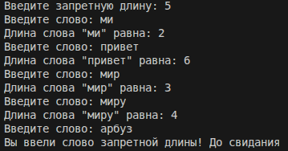
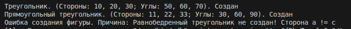
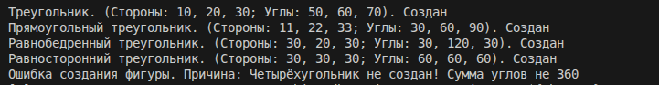
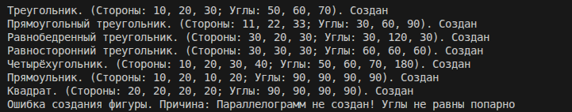
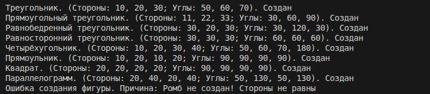

## Result

# Task 1

[main.cpp](./_task1/main.cpp)



# Task 2

[main.cpp](./_task2/main.cpp)









```
Фигура:
Правильная
Количество сторон: 0

Треугольник:
Правильная
Количество сторон: 3
Стороны: 10, 20, 30
Углы: 50, 60, 70

Прямоугольный треугольник:
Правильная
Количество сторон: 3
Стороны: 11, 22, 33
Углы: 30, 60, 90

Равнобедренный треугольник:
Правильная
Количество сторон: 3
Стороны: 30, 20, 30
Углы: 30, 120, 30

Равносторонний треугольник:
Правильная
Количество сторон: 3
Стороны: 30, 30, 30
Углы: 60, 60, 60

Четырёхугольник:
Правильная
Количество сторон: 4
Стороны: 10, 20, 30, 40
Углы: 50, 60, 70, 180

Прямоульник:
Правильная
Количество сторон: 4
Стороны: 10, 20, 10, 20
Углы: 90, 90, 90, 90

Квадрат:
Правильная
Количество сторон: 4
Стороны: 20, 20, 20, 20
Углы: 90, 90, 90, 90

Параллелограмм:
Правильная
Количество сторон: 4
Стороны: 20, 40, 20, 40
Углы: 50, 130, 50, 130

Ромб:
Правильная
Количество сторон: 4
Стороны: 40, 40, 40, 40
Углы: 45, 135, 45, 135

```