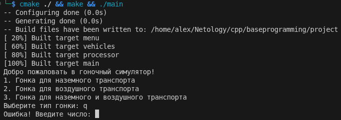
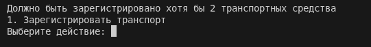
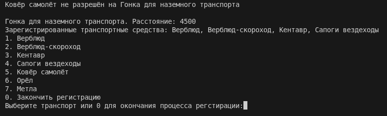
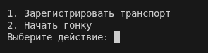
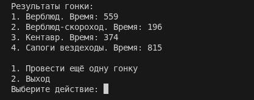
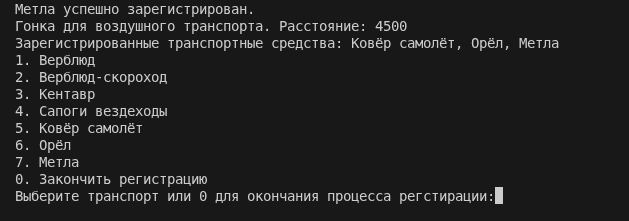
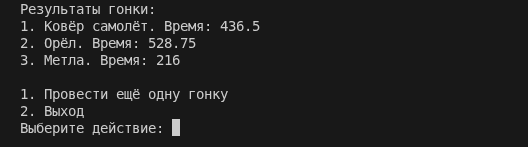

# Task 1

[CMakeLists.txt](./CMakeLists.txt)

[main.h](./main.h)

[main.cpp](./main.cpp)

[mymenu.h](./mymenu/mymenu.h)

[mymenu.cpp](./mymenu/mymenu.cpp)

[processor.h](./processor/processor.h)

[processor.cpp](./processor/processor.cpp)

[vehicle.h](./vehicle/vehicle.h)

[vehicle.cpp](./vehicle/vehicle.cpp)

[air.h](./vehicle/air/air.h)

[air.cpp](./vehicle/air/air.cpp)

[ground.h](./vehicle/ground/ground.h)

[ground.cpp](./vehicle/ground/ground.cpp)

## Result

