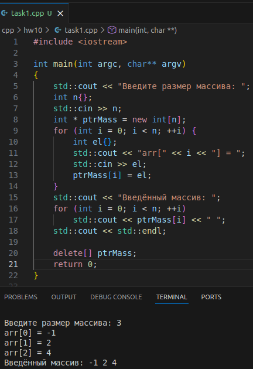
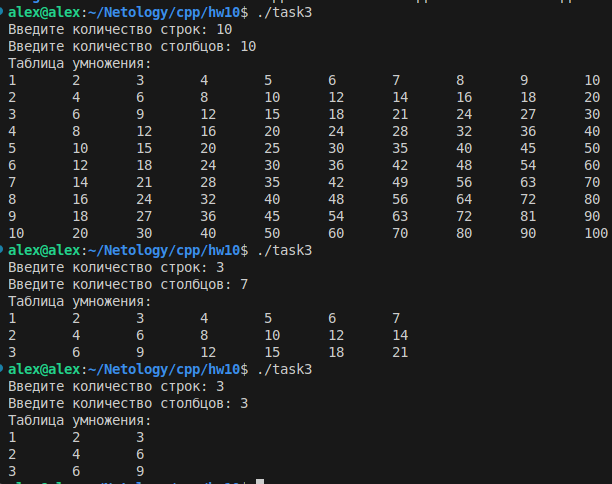

## Result
# Task 1



# Task 2


# Task 3

```
#include <iostream>

int** create_two_dim_array(int n, int m);
void fill_two_dim_array(int** arr, int n, int m);
void print_two_dim_array(int** arr, int n, int m);
void delete_two_dim_array(int** arr, int n, int m);

int main() {
    std::cout << "Введите количество строк: ";
    int n{};
    std::cin >> n;
    std::cout << "Введите количество столбцов: ";
    int m{};
    std::cin >> m;
    int** arr = create_two_dim_array(n, m);
    fill_two_dim_array(arr, n, m);
    std::cout << "Таблица умножения: " << std::endl;
    print_two_dim_array(arr, n, m);
    delete_two_dim_array(arr, n, m);

    return 0;
}

int** create_two_dim_array(int n, int m){
    int** arr = new int*[n];
    for (int i = 0; i < n; ++i) {
        arr[i] = new int[m];
    }
    return arr;
}

void fill_two_dim_array(int** arr, int n, int m) {
    for (int i = 0; i < n; ++i) {
        for (int j = 0; j < m; ++j) {
            arr[i][j] = (i+1)*(j+1);
        }
    }
}

void print_two_dim_array(int** arr, int n, int m) {
    for (int i = 0; i < n; ++i) {
        for (int j = 0; j < m; ++j) {
            std::cout<< arr[i][j] << "\t";
        }
        std::cout << std::endl;
    }    
}

void delete_two_dim_array(int** arr, int n, int m) {
    for (int i = 0; i < n; ++i) {
        delete [] arr[i];
    }
    delete[] arr;
}

```




