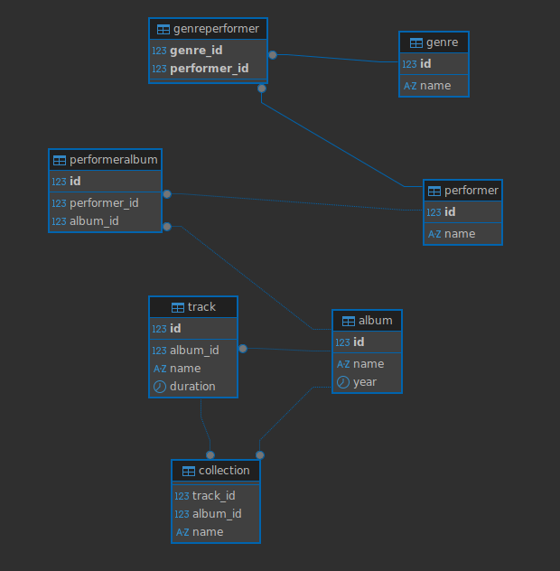
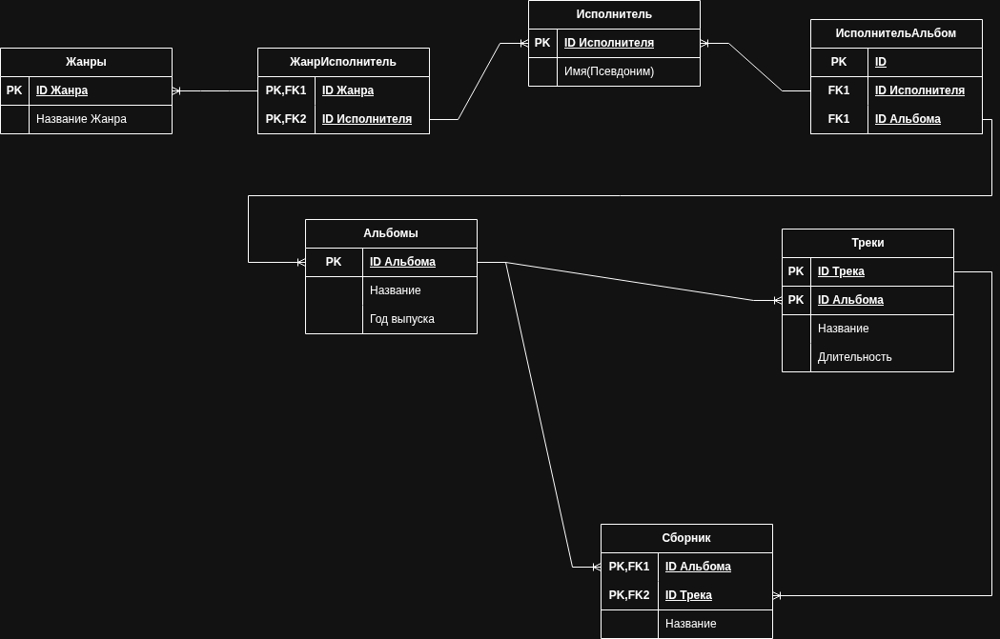
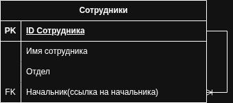
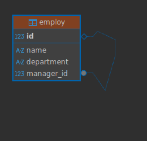

## Task1 

[sql script](./_task1/song_database.sql)





## Task2

```

create table if not exists employ (
	id serial primary key,
	name varchar(60),
	department varchar(100),
	manager_id integer references employ(id)
);


```



