[Создать БД](../hw2/_task1/song_database.sql)

## Task1

[Скрипт данных](./_task1/song_data.sql)

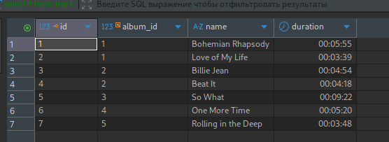

## Task2

[Корректировка БД, добавим год и русские песни](./_task2/song_correction.sql)

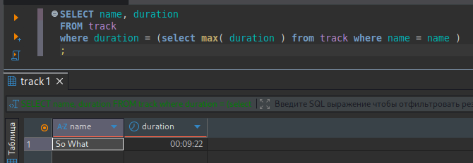

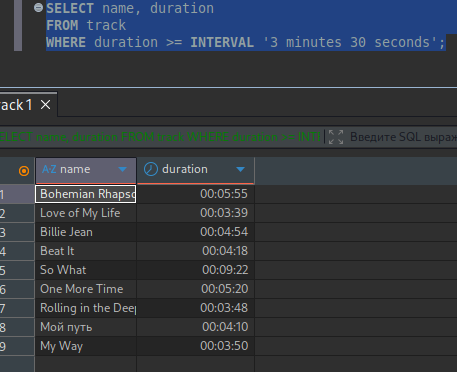

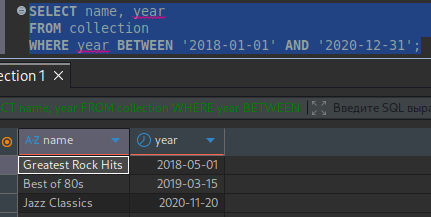

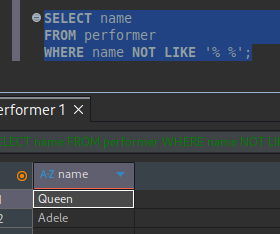

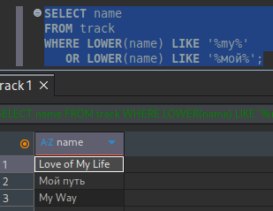

[Селекты](./_task2/song_select.sql)

## Task3

[Подгоним БД под реалии 3-ей задачи](./_task3/song_correction.sql)

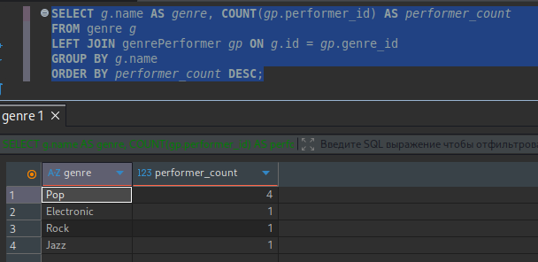

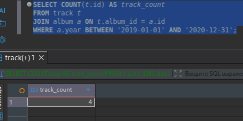

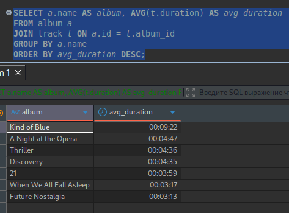

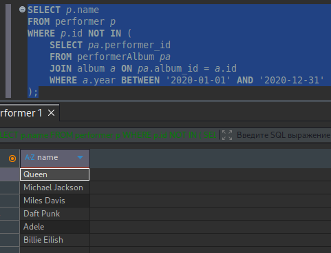

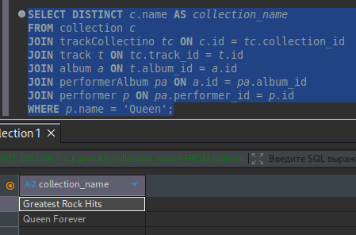

[Селекты](./_task3/song_select.sql)