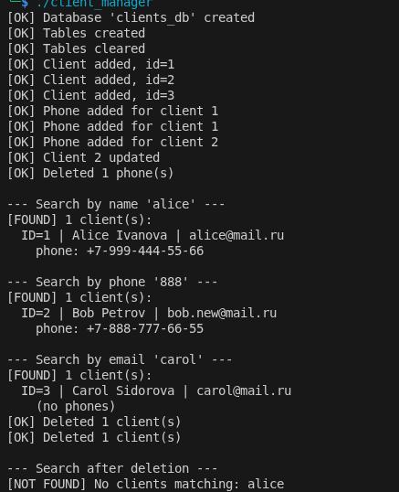

## Task1

[clientManager header](./_task1/clientManager.h)

[clientManager cpp](./_task1/clientManager.cpp)

[task1 cpp](./_task1/task1.cpp)

[CmakeLists txt](./_task1/CMakeLists.txt)



Добавить библиотеки разработчика:

```

sudo apt install -y libpq-dev postgresql-server-dev-all

```

Собрать libpqxx:

```
sudo apt install -y build-essential cmake libpq-dev git

cd /tmp
git clone --branch 7.9.2 --depth 1 https://github.com/jtv/libpqxx.git
cd libpqxx
cmake -S . -B build -DCMAKE_BUILD_TYPE=Release \
      -DCMAKE_INSTALL_PREFIX=/usr/local \
      -DBUILD_TESTING=OFF \
      -DSKIP_PGXX_TESTS=ON
cmake --build build -j"$(nproc)"
sudo cmake --install build
sudo ldconfig

```
