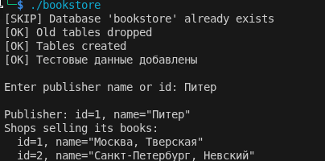

## Task1

[publisher](./_task1/publisher.h)

[book](./_task1/book.h)

[shop](./_task1/shop.h)

[stock](./_task1/stock.h)

[sale](./_task1/sale.h)

[task1 cpp](./_task1/task1.cpp)

[CmakeLists txt](./_task1/CMakeLists.txt)

## Task2

[publisher](./_task2/publisher.h)

[book](./_task2/book.h)

[shop](./_task2/shop.h)

[stock](./_task2/stock.h)

[sale](./_task2/sale.h)

[task1 cpp](./_task2/task1.cpp)

[CmakeLists txt](./_task2/CMakeLists.txt)




установка wt:

```

sudo apt update
sudo apt install -y \
    build-essential cmake git wget pkg-config \
    libpq-dev postgresql-server-dev-all \
    libssl-dev zlib1g-dev libfcgi-dev \
    libgraphicsmagick++1-dev \
    libhpdf-dev

```

Собрать Boost 1.83 в /opt/boost-1.83

```

cd /tmp
wget https://archives.boost.io/release/1.83.0/source/boost_1_83_0.tar.gz
tar xzf boost_1_83_0.tar.gz
cd boost_1_83_0

./bootstrap.sh --prefix=/opt/boost-1.83
sudo ./b2 install -j"$(nproc)" link=shared

grep BOOST_LIB_VERSION /opt/boost-1.83/include/boost/version.hpp
# Ожидаемо: #define BOOST_LIB_VERSION "1_83"

ls /opt/boost-1.83/lib/libboost_program_options.so
ls /opt/boost-1.83/lib/libboost_filesystem.so
ls /opt/boost-1.83/lib/libboost_thread.so
ls /opt/boost-1.83/lib/libboost_system.so
#Все 4 файла должны существовать.

echo /opt/boost-1.83/lib | sudo tee /etc/ld.so.conf.d/boost-1.83.conf
sudo ldconfig
ldconfig -p | grep boost_program_options
# Ожидаемо: libboost_program_options.so.1.83.0 => /opt/boost-1.83/lib/...

```

Собрать Wt 4.10.4 в /usr/local

```

cd /tmp
rm -rf wt
git clone --depth 1 --branch 4.10.4 https://github.com/emweb/wt.git
cd wt

rm -rf build
mkdir build && cd build

cmake .. \
    -DCMAKE_BUILD_TYPE=Release \
    -DCMAKE_INSTALL_PREFIX=/usr/local \
    -DBOOST_ROOT=/opt/boost-1.83 \
    -DBoost_NO_SYSTEM_PATHS=ON \
    -DBoost_INCLUDE_DIR=/opt/boost-1.83/include \
    -DBoost_LIBRARY_DIR=/opt/boost-1.83/lib \
    -DBUILD_EXAMPLES=OFF \
    -DBUILD_TESTS=OFF \
    -DENABLE_POSTGRES=ON \
    -DENABLE_MYSQL=OFF \
    -DENABLE_FIREBIRD=OFF \
    -DENABLE_MSSQLSERVER=OFF \
    -DENABLE_QT4=OFF \
    -DENABLE_QT5=OFF \
    -DENABLE_LIBWTTEST=OFF \
    -DSHARED_LIBS=ON \
    -DBoost_NO_WARN_NEW_VERSIONS=ON

make -j"$(nproc)" 2>&1 | tee build.log

sudo make install
sudo ldconfig

ls /usr/local/lib/libwt.so
ls /usr/local/lib/libwtdbo.so
ls /usr/local/lib/libwtdbopostgres.so

ls /usr/local/include/Wt/Dbo/Dbo.h
ls /usr/local/include/Wt/Dbo/backend/Postgres.h

find /usr/local -name "wt-config.cmake"

echo /usr/local/lib | sudo tee /etc/ld.so.conf.d/wt.conf
sudo ldconfig
ldconfig -p | grep wtdbo

```