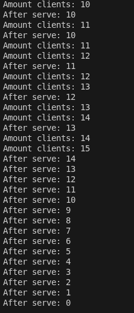
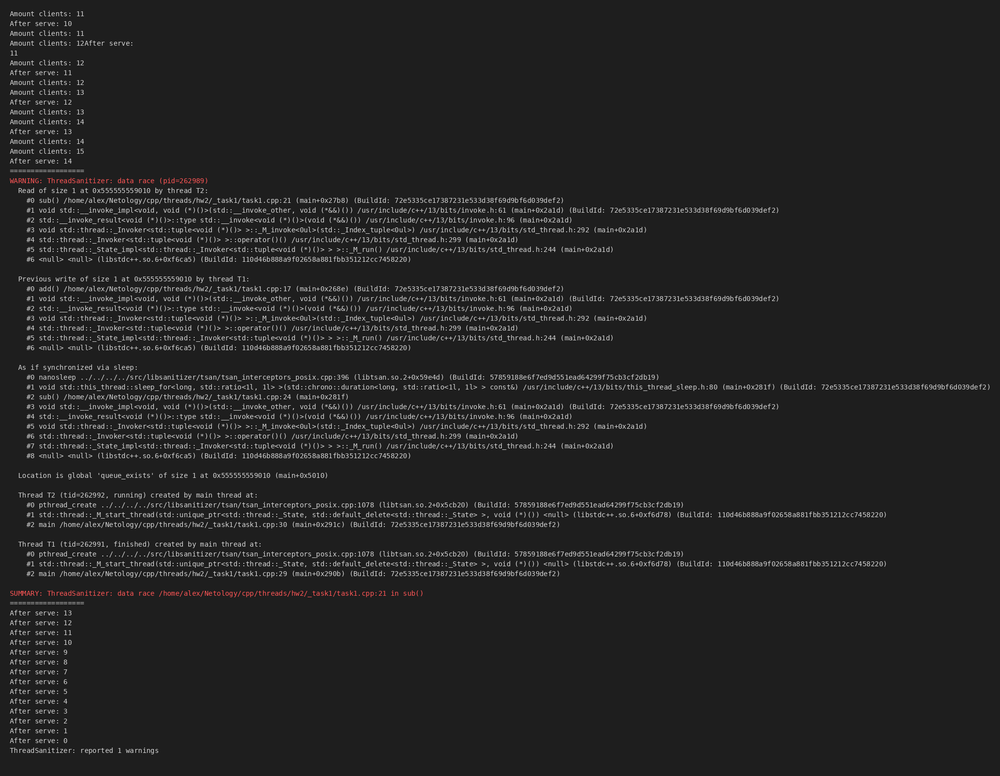
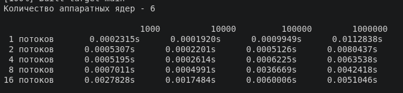

## Task 1

[task1 cpp](./_task1/task1.cpp)

[CMakeLists](./_task1/CMakeLists.txt)

Запуск до добавления атомарной переменной и санитайзера:

После добавления. Видим, что есть гонки:

## Task 2

[task2 cpp](./_task2/task2.cpp)

[CMakeLists](./_task2/CMakeLists.txt)

