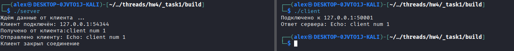
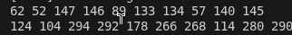

## Task 1

[server](./_task1/server.cpp)

[client](./_task1/client.cpp)

[CMakeLists](./_task1/CMakeLists.txt)

## Task 2

[server](./_task2/server.cpp)

[client](./_task2/client.cpp)

[CMakeLists](./_task2/CMakeLists.txt)

